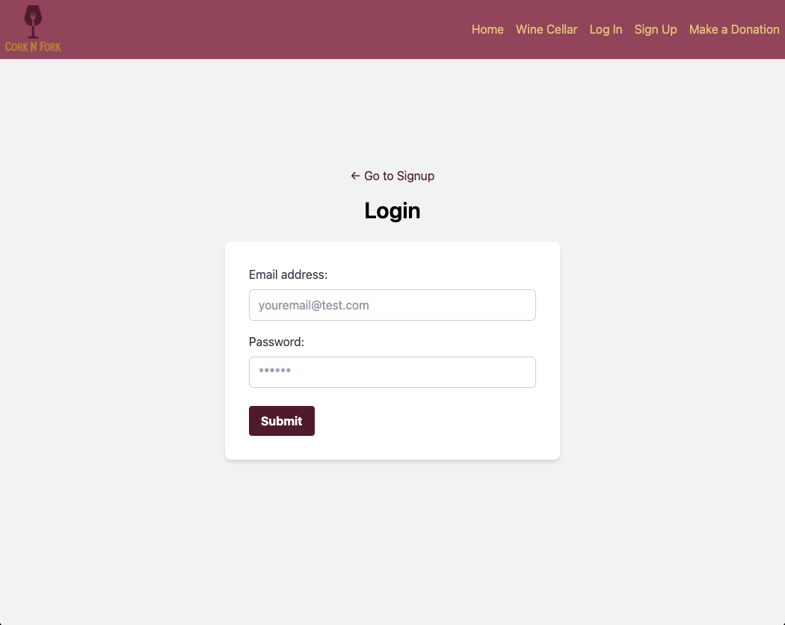
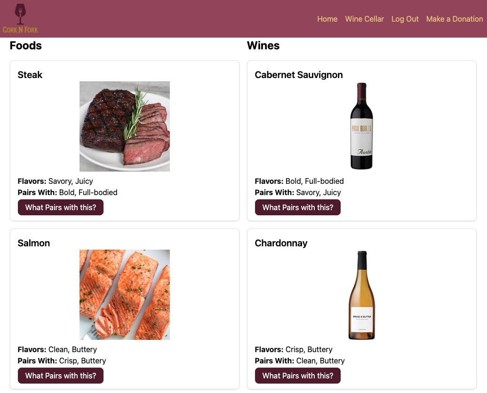
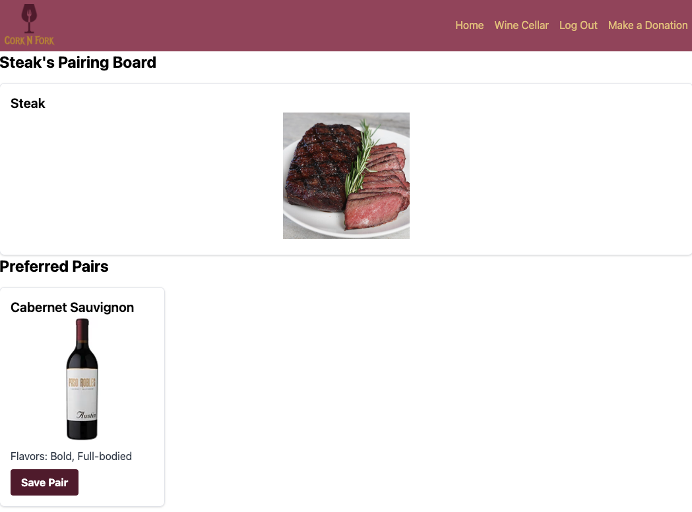
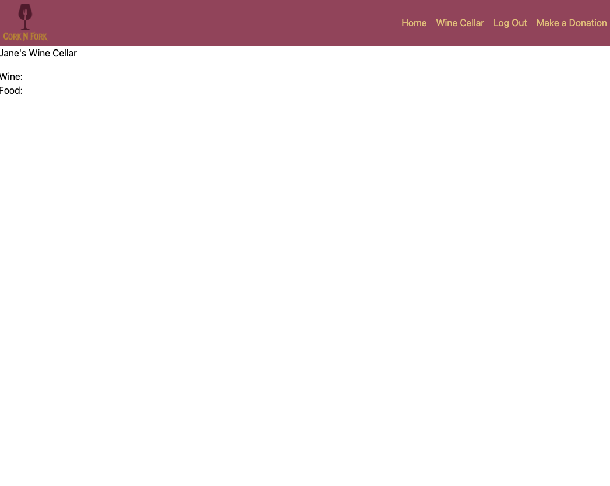

# Cork N Fork

## Description

Cork N Fork is a groundbreaking pairing portal built with an interactive MERN stack single-page application. This platform offers an extensive selection of wines, flavor palettes, and foods, enabling users to find the perfect wine to complement their meal or vice versa. Additionally, Cork N Fork allows users to save their favorite wines and pairings to their profiles for future reference.

## Table of Contents

- [Installation](#installation)
- [Usage](#usage)
- [Credits](#credits)
- [License](#license)
- [Questions](#questions)

## Installation

No installation necesssary. Simply visit https://corknfork.com.

[Link to CorkNFork Github Repository](https://github.com/kleppy/corknfork.git)

## Usage

1. Sign Up

   - Navigate to the Home Page of CorknFork.
   - Click "Sign Up" in the top right corner to create an account.
   - Upon completion, you will be automatically signed in.

     

2. Account Management

   - You can log out at any time and log back in using your credentials.

     

3. Exploring Pairings

   - Return to the Home Page using the navigation links at the top.

     

   - Find a wine or food item of interest and click "What Pairs with this?".
   - This will bring up a pairing page for the selected item.

     

   - If a pairing interests you, click "Save Pair" to add it to your cellar.

4. Viewing Saved Pairs

   - Navigate to "Wine Cellar" to see all the pairs you have saved.

     

## Credits

Main Contributors: [Jon](https://github.com/kleppy), [Erin](https://github.com/sinclairems), [Jesse Denier](https://github.com/JesseDenier), [James Ohlhausen](https://github.com/OhlhJames), [Chelle Wood](https://github.com/chelleyoungw)

Additional Contributors: None

3rd Party Assets and Tutorials Used: None

## License

This project is licensed under the terms of the MIT license. See the badge at the top of the README for more details.

## Questions

Feel free to reach out to us with any additional questions through the following methods:

TODO: Insert Methods and Contact Info (jesse, james, jon, erin)

<ins>Github</ins>
- [Link to Chelle Wood's Github](https://github.com/chelleyoungw)

<ins>Email</ins>
- <a href="mailto:chelleyoungw@gmail.com">chelleyoungw@gmail.com</a>
